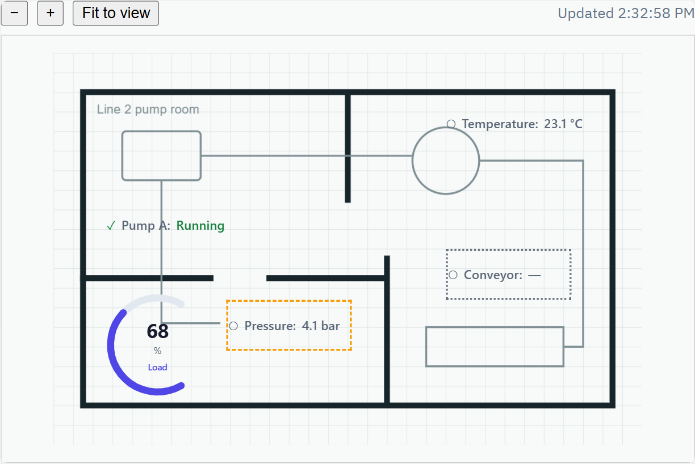

# U-Board

Spatial dashboard authoring middleware. Build data-bound views on a canvas — a floor plan, a
network diagram, a map, or a freeform layout — and embed the result anywhere on the web.



The board above runs live at the top of [board.u-platform.kr](https://board.u-platform.kr/) — the
library's own viewer, reading a sample source inside the page — and
[board.u-platform.kr/try/](https://board.u-platform.kr/try/) opens the authoring view on the same
board, kept in the browser and exported as a file an installation imports. iyulab also operates a demo
instance at [board-app.u-platform.kr](https://board-app.u-platform.kr/), where invited accounts can
try authoring and sharing before installing; to install U-Board on your own network, see
[docs/self-hosting.md](docs/self-hosting.md).

## Who this is for

Teams building operational software (asset management, industrial monitoring, facility
operations, and similar domains) who need to embed a live status view — equipment on a floor
plan, a system topology, a site map — in their own application, without building a spatial canvas
renderer from scratch. A view reads its values from the systems that own them when it is shown;
nothing has to be collected into a platform of U-Board's first.

U-Board runs standalone against any external data source through its adapter surface — it does
not assume or require a specific host platform.

Several CMMS/facility-management products already ship their own interactive-floor-plan feature
(Hippo, FMX, eMaint, and similar) — U-Board isn't meant to replace that when one system already
covers the need. It's for the case a single vendor's built-in view can't: a live view spanning
more than one source system (e.g. CMMS asset status next to a separate SCADA feed on the same
floor plan), or embedding that view somewhere the source system's own UI has no reach. The
adapter surface is what buys that — a view isn't locked to whichever vendor's floor-plan feature
happened to be good enough.

Every bound value carries its own connection quality — live, stale, or disconnected — and, when it
is not live, the reason: the source is unreachable, the credentials were refused, the value was not
found at the source, the answer could not be read, the request was rate limited, or the source itself
has fallen behind on its updates. Each widget shows its own state (a distinct
frame, with the reason as its tooltip and for screen readers), so one failing source does not turn
the whole view into an error.

## What this is not

- Not a general business-intelligence tool — no chart-and-pivot-table dashboards over a data
  warehouse.
- Not an HMI/SCADA package. There is no symbol library, alarm handling, control output, or screen
  navigation; U-Board draws status views, and the host application around them keeps those
  responsibilities.
- Not a full 3D digital-twin engine. Views are 2D/2.5D; a rotating 3D model of a single object
  is out of scope and left to a dedicated component if one is ever needed.
- Not a business application. U-Board does not own or store domain data — it binds to values
  that live in the systems that already own them.

## Status

This project is in early development. The rendering pipeline (canvas-kit + u-widgets), the
authoring UI (set the background image; add/drag/resize nodes and rect/text decorations; a
property panel for editing the selected node's widget type, static props, and data bindings,
including a path explorer for HTTP-shaped adapter responses and a value map that turns a source's
words or numbers — by exact value or numeric range — into what the widget takes; a label editor for
the selected text decoration), export/import of the document as a file (beside the host's own
Save, when it has one), and a read-only viewer mode are implemented and browser-verified. The editor and
the viewer fill their container, open with the board fitted into view, and pan and zoom by pointer
or keyboard.
Binding to a real external data source is implemented and deployed — a generic HTTP(S) connector
adapter (with SSRF-safe origin pinning, and either a static credential — a bearer token, a header, or a key in the address (a query parameter or a
path segment, put in only when the request is sent) — or OAuth 2.0
client credentials with cached, auto-renewed access tokens) is wired into both the authoring UI
and the read-only embed viewer. It picks a value out of a JSON response with an RFC 6901 JSON
Pointer, reports why a binding is not live (source unreachable, credentials refused, value not
found at the source, rate limited), and the embed viewer resolves all of a board's bindings in one
request, again every 30 seconds while it is open. A connector's settings can be tried before they are saved, its credentials are kept on the server
sealed under an installation key, and the addresses connectors may
reach are an installation setting — never the server's own loopback, link-local or cloud host addresses. A connector to a specific external system that needs its own
domain knowledge (e.g. a real CMMS) still requires access to that system and doesn't exist yet —
until then, a built-in demo adapter with fixed sample values is available in the authoring UI so a
board can be wired up and previewed before any real connector is configured. The hosted
applications (see [Repository layout](#repository-layout)) add workspaces with members,
server-side board storage, managed connectors, and read-only share links — on an installation run by
an operator who creates each organization's workspace and can recover one whose owners are gone,
and a record of who changed members, roles, invitations, boards, share links and connectors.
They are released together as a versioned container image — on GitHub Releases with an archive for
networks without internet access, both carrying a build provenance attestation, and changes recorded
in [`CHANGELOG.md`](CHANGELOG.md); an operator sees the installed version in the console.

## Repository layout

| Workspace | Package | What it is |
|---|---|---|
| `packages/core` | `@iyulab/u-board` (npm) | The library: view document schema, adapter contract, binding resolution, the canvas rendering pipeline, the authoring UI and the read-only viewer. Everything below this section documents it. |
| `packages/server` | private | HTTP API for workspaces, members and invitations, accounts (sign-in, password, deletion), the installation's operators, boards, data connectors, share links, and the activity record. Stores data in Postgres. |
| `packages/console` | private | Web console for that API: sign-in and account, members and the activity record, board editing (with the authoring UI above), connectors with a connection test, issuing share links, and an installation page for operators. Its sidebar carries the U-Platform affiliation. |
| `packages/share` | private | Read-only embed viewer that opens a board from a share link, using only the library's `viewer` entry point. |
| `packages/site` | private | The introduction site at board.u-platform.kr (Korean at `/`, English at `/en/`). Every statement it makes about the product has a row in its `claims.tsv` — status and the files that back it — checked against the pages by its tests. |

The three applications are how U-Board runs as a service installed on your own network; a host application that only
needs the library does not need any of them. They ship as one container image,
`ghcr.io/iyulab/u-board` — published with each GitHub release under the product's own version,
apart from the library's — serving one origin: the API under `/api`, the share viewer under
`/share/`, and the console at every other path — see [`docs/self-hosting.md`](docs/self-hosting.md). [`CONTRIBUTING.md`](CONTRIBUTING.md) covers building
and testing the whole workspace.

## Domain layer

The renderer-agnostic core — the view document schema, the adapter contract, and binding
resolution — is available as a package entry point independent of the authoring UI and canvas
rendering pipeline described below. It is published to npm as
[`@iyulab/u-board`](https://www.npmjs.com/package/@iyulab/u-board); import it from the
`/domain` subpath to leave the React and canvas stack out entirely:

```sh
npm install @iyulab/u-board react react-dom
```

```ts
import { resolveDocument, type ViewDocument, type Adapter } from '@iyulab/u-board/domain';

const doc: ViewDocument = { kind: 'canvas', background: {}, nodes: [], connectors: [] };
const adapters: Adapter[] = [/* your Adapter implementations */];

const resolved = await resolveDocument(doc, adapters);
```

`resolveDocument` is the single entry point a renderer calls to turn a saved `ViewDocument` into
something paintable — it has no opinion on canvas-kit, u-widgets, or any other rendering concern.
See [`docs/concepts.md`](docs/concepts.md) for the vocabulary (`ViewDocument`, `Binding`,
`Adapter`) and [`docs/architecture.md`](docs/architecture.md) for how this layer fits the rest of
the system. **See [`docs/api-reference.md`](docs/api-reference.md) for the full type reference and
a runnable example that implements an `Adapter` and inspects `resolveDocument`'s result.** The
package is ESM-only and needs Node 22.12 or later.

## Authoring UI

`AuthoringView` — a canvas-kit designer for setting the background image (a PNG, JPEG, WebP, GIF or
SVG file of up to 4 MB, kept inside the document) and adding/dragging/resizing nodes and decorations, paired
with a property panel for editing the selected node's widget type, static props, and data bindings
(including a path explorer that walks an HTTP adapter's response tree and writes a JSON Pointer
to the picked value — and, for a value inside a list, can name the list item by one of its fields, such
as an id, instead of its position, since sources reorder their lists), the selected text
decoration's label, or — with nothing selected — the board's own background and tone — is exported from the package's main entry point alongside the read-only
`ViewerPage`. An adapter that lists its references (`Adapter.references()`) is bound by picking
one from that list; any other takes an HTTP connector reference. The background and the connector
lines stay put while nodes and decorations are edited:

```ts
import { AuthoringView, type Adapter } from '@iyulab/u-board';
```

The board is edited with each widget drawn in place, and an Edit / View switch shows it as a shared
link does, pan and zoom kept; without a `width`/`height` the board fills the parent beside the
property panel, so give the parent a definite height. The [package README](packages/core/README.md) covers sizing
and view controls.

Unlike the domain layer above, this surface depends on canvas-kit and renders to the DOM directly —
a host application embeds it as-is rather than building its own authoring UI against the domain
layer. `ViewerPage` alone (with none of the authoring UI's weight) is also available from the
lighter `@iyulab/u-board/viewer` entry point, for a host that only needs to render, not author. See
[`docs/architecture.md`](docs/architecture.md) for how this fits the editor/renderer split.

## Documentation

| Topic | Doc |
|---|---|
| Problem, audience, role | [`docs/overview.md`](docs/overview.md) |
| Design principles and their costs | [`docs/principles.md`](docs/principles.md) |
| What's in scope, what's out | [`docs/scope.md`](docs/scope.md) |
| System structure | [`docs/architecture.md`](docs/architecture.md) |
| Core concepts and terms | [`docs/concepts.md`](docs/concepts.md) |
| Domain layer API reference | [`docs/api-reference.md`](docs/api-reference.md) |
| Running the server, console and share viewer | [`docs/self-hosting.md`](docs/self-hosting.md) |

## Contributing

Bug reports and design questions are welcome. Because U-Board is dual-licensed, external code
contributions need a signed CLA before they can be merged — it is one file you add in your own
pull request. See [`CONTRIBUTING.md`](CONTRIBUTING.md) and [`CLA.md`](CLA.md).

## License

Copyright (c) 2026 iyulab.

AGPL-3.0-or-later. A commercial license is available for organizations that cannot adopt AGPL-3.0
terms.
See [`LICENSE`](LICENSE).

The console and the introduction site show U-Platform affiliation through the
[`@uplatform/brand`](https://www.npmjs.com/package/@uplatform/brand) package. Its code is MIT; the
marks and product names it carries are trademarks of iyulab with limited permitted use (see that
package's `LICENSE`), and are not covered by this repository's license.
